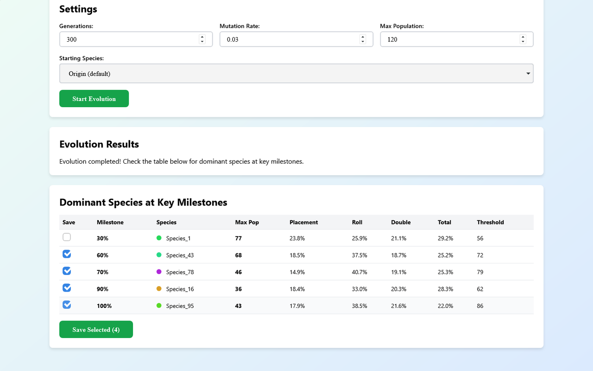
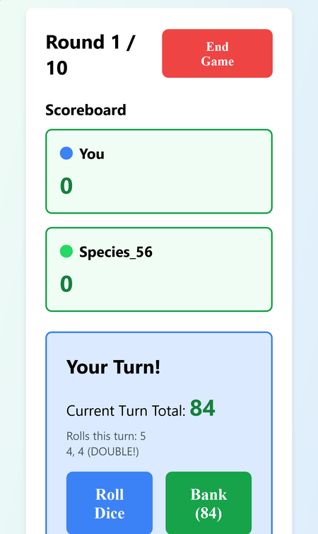
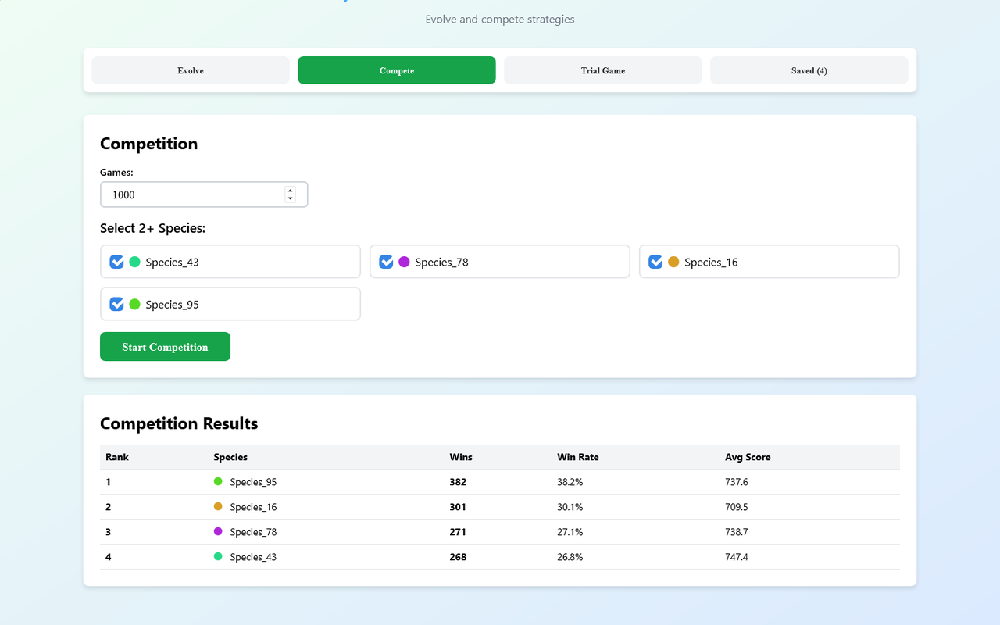

# BANK Evolution

A natural-selection simulator for the dice game BANK. Strategies play thousands of games against each other, the winners breed, mutations create new species, and you can save the best ones, race them head to head, or play a game against them yourself.

**[▶ Open the live app](https://timothyhadfield.github.io/bank-evolution/)** · works on phone and laptop

  
  &nbsp;
  

## Features
- **Evolve strategies**: set the number of generations, mutation rate and maximum population, then let the population compete and breed.
- **See who took over**: a table shows the dominant species at each milestone of the run (10%, 20%, ... 100%), with its peak population, strategy weights and banking threshold.
- **Save species**: tick the ones you like and keep them in your browser. A saved species can also be the starting point for a new run.
- **Compete**: pit two or more saved species against each other over hundreds or thousands of games and rank them by wins, win rate and average score.
- **Trial game**: play a 10-round game yourself against saved species, with everyone sharing the same dice, plus live statistics on sums and doubles.

  

## How it works
Every strategy is a small genome: four weights that always add up to 100% and a threshold.

| Factor | What it rewards |
| --- | --- |
| Placement | banking when it would put you ahead of the other players |
| Roll count | banking as the round gets longer and riskier |
| Double | banking right after doubles have multiplied the pot |
| Total | banking as the turn total grows |

After the three safe rolls, a strategy adds up its weighted factors each roll and banks once the score passes its threshold. Each generation runs 20 random four-player games. The winner of each game breeds if there is room in the population, and each loser has a chance of dying out. When a child mutates, its weights and threshold shift slightly and it becomes a new species.

## Built with
Plain HTML, CSS and JavaScript in a single file, with saved species kept in the browser's localStorage. Hosted on GitHub Pages.
